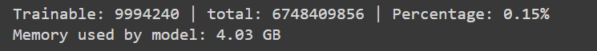
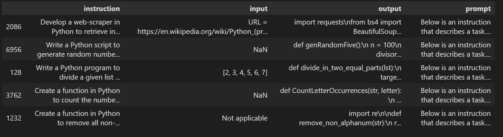
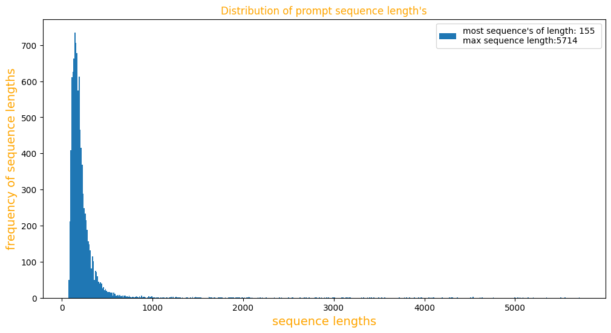
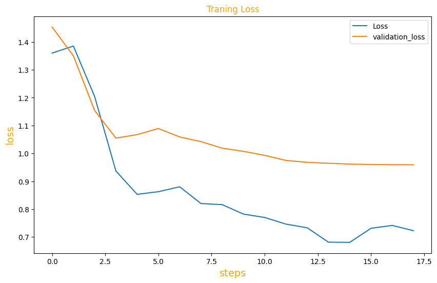
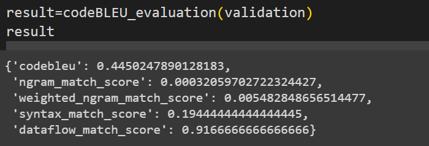

## Fine-Tuning of LLAMA2 Using QLORA

---

[Introduction,](#introduction)
[Why Fine-Tuning with QLORA Technique,](#why-fine-tuning-with-qlora-technique)
[QLORA,](#quantization-technique-and-lora)
[Preprocessing the Datasets,](#preprocessing-the-datasets)
[Training with Various Parameter Tweaks and Optimizations,](#training-with-various-parameter-tweaks-and-optimizations)
[Results of Training,](#results-of-training)
[Evaluation Using CodeBLEU,](#evaluation-using-codebleu)
[Conclusion](#conclusion)

## Introduction

In recent years, large language models (LLMs) have exhibited remarkable capabilities across various tasks. However, their increasing size, memory consumption, and extended training times present significant challenges, particularly for those with limited computational resources.Fortunately, there exists a low dimension reparameterization that is as effective for fine-tuning as the full parameter space empirically shown in the paper **“Intrinsic Dimensionality Explains the Effectiveness of Language Model Fine-Tuning.”** This project explores the application of the QLORA technique to fine-tune the LLAMA2-7b model with significantly fewer trainable parameters, aiming for efficient training on a single GPU. By quantizing the model to 4-bit precision and introducing low-rank adapters (LoRA) in the linear layers, we achieve performance comparable to the original full-precision model. The model is evaluated using the codeBLEU metric on a dataset of code completions for coding tasks, demonstrating the efficacy of our approach.

---

## Why Fine-Tuning with QLORA Technique

Fine-tuning large language models is crucial for adapting them to specific tasks and domains. Traditional fine-tuning methods require loading the entire model into memory and updating its parameters, which is computationally expensive and often infeasible on medium-sized GPU resources. For instance, a 1B parameter model takes 4GB of GPU RAM at 32-bit precision. However, training this model requires memory for parameters, gradients, optimizer states, and activations, totaling about 20GB of GPU RAM, which far exceeds the capacity of most single GPUs.

 **Model Parameter:** 4 bytes per parameter 
 **Gradients:** 4 bytes per parameter 
 **ADAM Optimizer:** 8 bytes per parameter (2 states) 
 **Activations and temp memory:** 8 bytes per parameter (variable size) 
 **Total:** 4 bytes parameter (model) + 20 extra bytes per paramter (training) 
 So, the memory needed to train is **~5X** the memory needed to store the model.

The QLORA technique addresses these challenges by quantizing the model's weights to lower precision and introducing low-rank adapters (LoRA) to the linear layers. This approach reduces the model size and the number of trainable parameters, making fine-tuning feasible on limited hardware while maintaining performance.

## Quantization Technique and LoRA

### Quantization with Bitsandbytes

**Quantization** reduces the memory and computational demands of language models by representing parameters with fewer bits. QLoRA employs a 4-bit NormalFloat data type, using only 4 bits to encode numbers, creating 16 buckets for model parameters. This method optimizes the storage of normally distributed data, where parameters tend to cluster around zero, maximizing the efficiency of the limited bit representation.

**Blockwise quantization** addresses the issue of extreme values skewing the quantization process. Instead of using a single quantization constant for the entire model, which can be affected by outliers, the model parameters are divided into 64 smaller blocks. Each block has its own quantization constant, reducing the influence of large values and providing more accurate quantization for each block. However, this approach increases memory usage since more constants need to be stored additionally 0.5 bits per parameter.

**Double quantization** further reduces memory usage by quantizing these blockwise constants themselves. After computing the quantization constants for each block (typically stored as FP32 values), these constants are further quantized to 8-bit integers, significantly lowering the memory footprint from 0.5 bits per parameter to approximately 0.127 bits per parameter. This nested quantization approach ensures efficient memory usage while maintaining the model's performance and accuracy.

### Low-Rank Adaptation (LoRA)

Low-Rank Adaptation (LoRA) is a technique that inserts trainable low-rank matrices into the transformer linear layers of the model. These adapters allow the model to learn task-specific adjustments without modifying the original weights, which remain frozen. The PEFT library facilitates the integration of LoRA into the LLAMA2 model, providing a flexible and efficient mechanism for fine-tuning.

**Meta-LLaMA/Llama-2-7b**, originally 28GB in size at 32-bit precision, requires an additional 140GB of RAM for traditional fine-tuning methods, which is impractical on medium-sized GPUs. After quantization and applying LORA to the model, its size reduces to 4GB. The number of trainable parameters constitutes only 0.15% of the total, as depicted in the figure below. Moreover, the model now only requires an additional 20GB of RAM, totaling 24GB, making it feasible to run on a single GPU.This shows the effectiveness of QLORA in improving efficiency and resource utilization.

## Preprocessing the Datasets

The datasets used for fine-tuning consist of 10000 samples of python code completions related to coding tasks. The preprocessing pipeline involves several key steps:

1. **Prompt Format**:To help the model quickly understand and differentiate between system prompt, instruction, inputs, and answers, samples needs to be formatted as shown in the figure below. This structured format enables the model to learn more quickly, significantly reducing the number of samples required for it to understand these distinctions on its own compared to an unformatted approach.

Some random samples form the Dataset

2. **Distribution of Sequence Length**:finding the distribution of sequence lengths to determine the maximum sequence length.From the Figure max length is 5714, it is not practicle for small resources therefore 90 percentile length is taken, which is close to 512 is taken as max length.

3. **Tokenization, Padding and Batching**: It is done automatically by SFTTrainer

## Training with Various Parameter Tweaks and Optimizations

To optimize the fine-tuning process on a single GPU, several techniques are employed:

1. **Gradient Accumulation Steps**: This approach accumulates gradients over multiple steps before updating the model parameters, effectively simulating a larger batch size.
2. **Gradient Checkpointing**: Saves memory by recomputing intermediate activations during the backward pass instead of storing them.
3. **Mixed Precision Training**: Combines 16-bit and 32-bit precision to speed up training and reduce memory usage without compromising model accuracy.
4. **Paged Optimizers**: These optimizers manage memory more efficiently by swapping in and out the required parameter segments.
5. **Gradient Clipping by Normalization**: Normalizing and clipping gradients to prevent exploding gradients, ensuring stable and reliable training
6. **Learning Rate Scheduler**: Dynamically adjusts the learning rate during training to ensure optimal convergence.

## Results of Training

Throughout the training process, both training loss and validation loss were monitored to ensure the model's effectiveness. The results, as shown in the figure below, indicate a decrease in both training and validation loss over steps, suggesting that the model is neither underfitting nor overfitting but is well-generalized using the QLORA technique. The quantized LLAMA2 model with LoRA layers demonstrated performance close to that of the full-precision model.

## Evaluation Using CodeBLEU

The fine-tuned model's performance was evaluated using the codeBLEU metric, which assesses the quality of generated code completions based on factors like n-gram match, weighted n-gram match, syntax match and dataflow match. The codeBLEU score shown in the figure indicate that the QLORA-enhanced model performs competitively, showcasing its potential for practical applications in various tasks.

## Conclusion

This project demonstrates that the QLORA technique-combining model quantization with low-rank adaptation, offers a viable solution for fine-tuning large language models on limited hardware resources. By significantly reducing the number of trainable parameters and memory requirements, this approach enables efficient training while maintaining high performance. The successful application of QLORA to the LLAMA2-7b model for code completion tasks shows its effectiveness and potential for broader adoption in NLP tasks requiring fine-tuning on specialized datasets.
